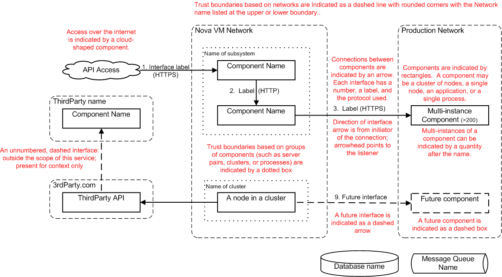

=============================
Architecture page template
=============================

Project name architecture - version/release
-------------------------------------------
**Status**: Draft/Ready for Review/Reviewed

**Release**: Juno/Kilo/Liberty if applicable

**Version**: 0.01 if applicable

**Contacts**:

- PTL: name - irc handle

- Architect: name - irc handle

- Security Reviewer: name - irc handle
- Security Reviewer: name - irc handle

Project description and purpose
~~~~~~~~~~~~~~~~~~~~~~~~~~~~~~~
A brief description of the purpose of the project. This should be a paragraph
or two and can be cut/paste from wiki or other documentation. Include links
to relevant presentations and further documentation if available.

Primary users and use-cases
~~~~~~~~~~~~~~~~~~~~~~~~~~~
A short statement about the expected primary users of the implemented
architecture, 'users' can either be actors or other services within OpenStack.

For example:

#. Administrators will use this tool to manage storage quotas
#. Nova will fetch TLS certificates for nova-migrate
#. IaaS services e.g cinder, neutron-lbaas and nova for encryption key
   generation and storage.

External dependencies & associated security assumptions
~~~~~~~~~~~~~~~~~~~~~~~~~~~~~~~~~~~~~~~~~~~~~~~~~~~~~~~
External dependencies are items outside of the control of the service that are
required for its operation, and may impact the service if they were compromised
or became unavailable. These items are usually outside the control of the
developer but within the control of the deployer, but may be operated by a
third party.

For example:

- Nova compute service is configured in accordance with security best practice.
- AWS object storage.

Components
~~~~~~~~~~
A list of the components of the deployed project excluding external entities.
Each component should be named and have a brief description of its purpose, and
be labeled with the primary technology used (e.g. Python, MySQL, RabbitMQ).

For Example:

- keystone listener process (Python): Python process that consumes keystone
  events published by the keystone service.
- Database (MySQL): MySQL database to store barbican state data related to its
  managed entities and their metadata.

Service architecture diagram
~~~~~~~~~~~~~~~~~~~~~~~~~~~~
Insert Service Architecture diagram here. For diagram requirements see
Architecture Diagram guidance in the OpenStack Security Guide.

Data assets
~~~~~~~~~~~
Data assets are user data, high-value data, configuration items, authorization
tokens or other items that an attacker may target. Data assets should include a
statement of where that asset is persisted.

For example:
- *ACL rules* - persisted in database
- *DB Credentials* - persisted in barbican.conf
- *Middleware configuration* - persisted in paste.ini
- *[PKCS#11] HSM HMAC Key* - persisted in HSM

Data asset impact analysis
~~~~~~~~~~~~~~~~~~~~~~~~~~
List all data assets listed above, briefly describe the impact to the system
that an integrity failure, loss of confidentiality or loss of availability
would have to the system. Project architects should attempt to complete this
prior to the review to minimise the time required.

For example:

Data Assets:
- *RBAC/ACL rulesets*:

  - Integrity Failure Impact: Attacker with valid AuthN could be granted access
    to any secret.
  - Confidentiality Failure Impact: Mappings between users and secrets are
    exposed.
  - Availability Failure Impact: barbican will not start if the file is not
    readable.

Interfaces
~~~~~~~~~~
List interfaces within the scope of the review: connections that cross a trust
boundary, connections that do not use a industry standard encryption protocol
such as TLS or SSH. Capture the following information for each interface:

Number. From -> To *[Transport Protocol]*

- Assets in flight: List all data assets traveling across the interface.
- Brief description of the impact of a successful attack on this interface.

For example:

1. Administrator->API Process *[TLS]*:

   - Assets in flight: barbican admin keystone Credentials
   - An attacker with access to the admin credentials can modify quotas,
     expanding or reducing them for any user. This has potential availability
     impact. Denial of Service.

Resources
~~~~~~~~~

- URL related to this project
- URL related to this project
- URL related to this project
